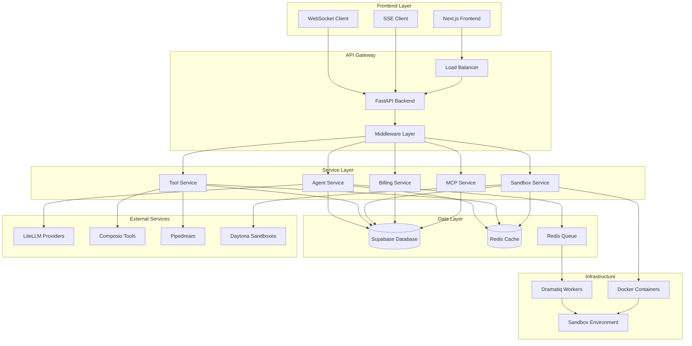
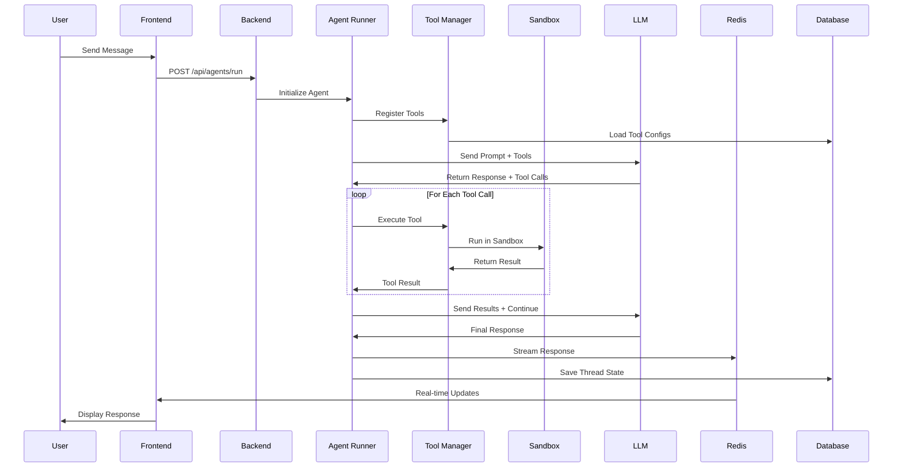
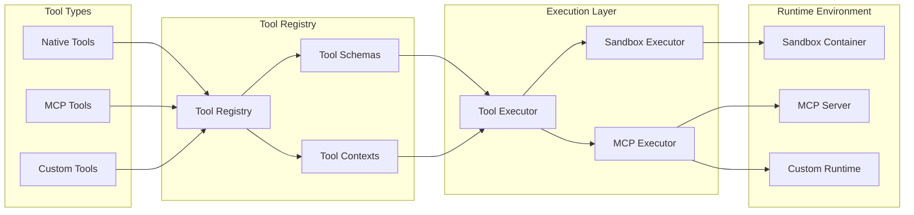
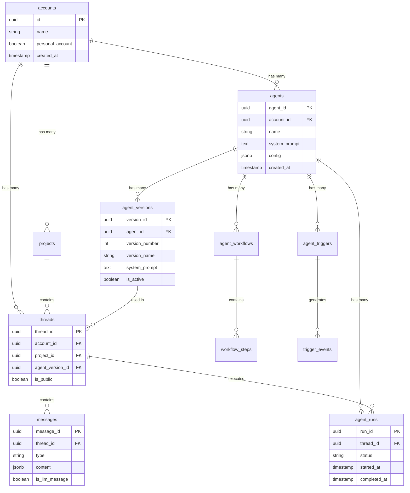
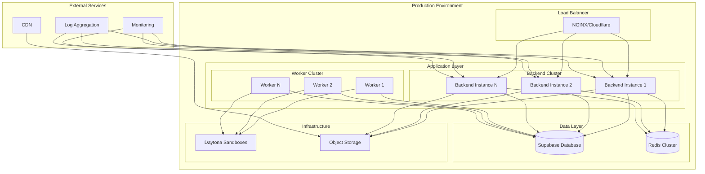
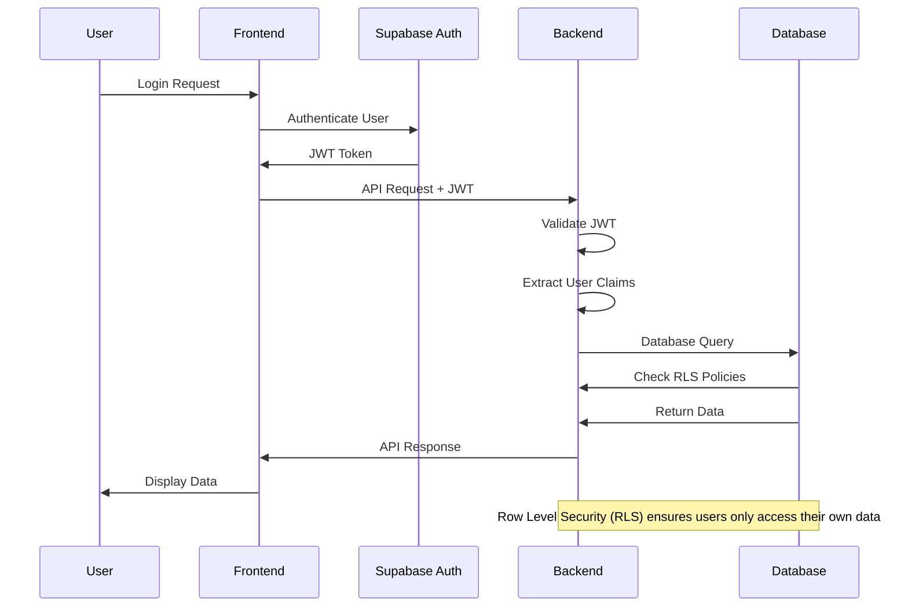
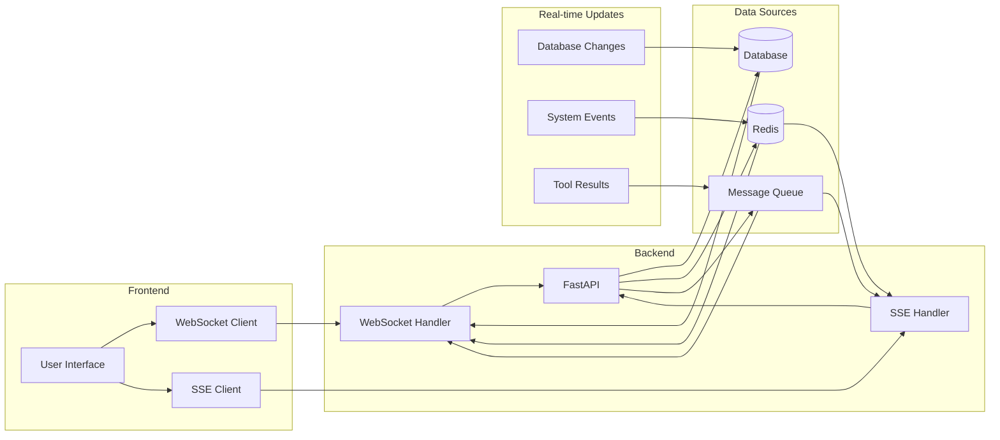
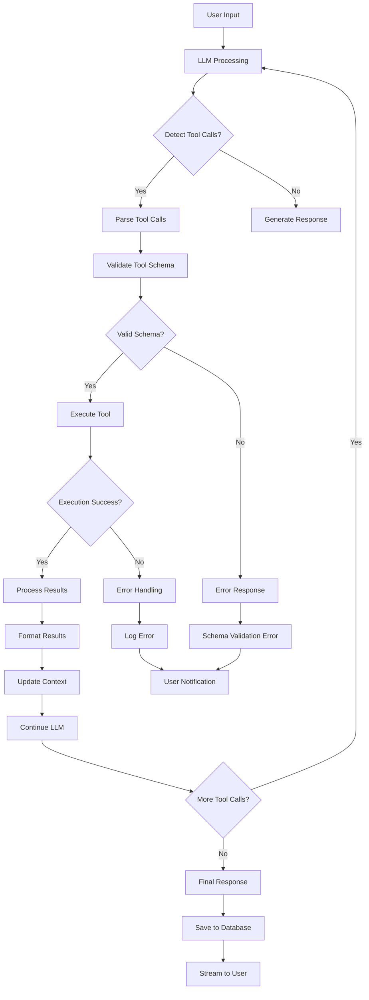
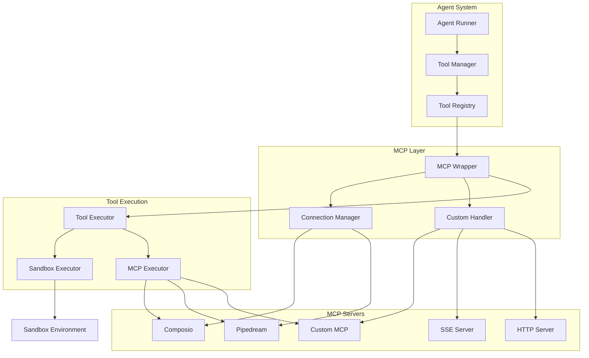
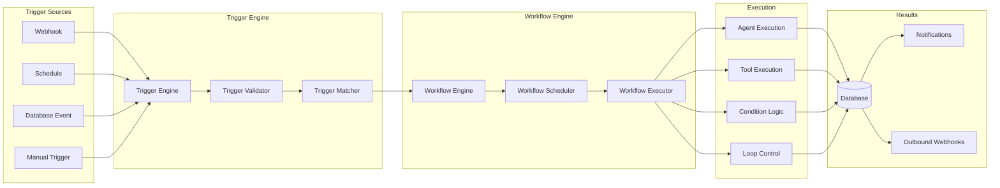

# Xera/Suna AI Worker - Architecture Diagrams

## System Overview Diagram

## Agent Execution Flow

## Tool Integration Architecture

## Database Schema Overview

## Deployment Architecture

## Authentication & Security Flow

## Real-time Communication Flow

## Tool Execution Pipeline

## MCP Integration Architecture

## Workflow & Trigger System

---

## Diagram Usage

These Mermaid diagrams can be rendered in:
- **GitHub**: Native Mermaid support
- **GitLab**: Native Mermaid support  
- **Notion**: With Mermaid plugin
- **VS Code**: With Mermaid extension
- **Online**: [Mermaid Live Editor](https://mermaid.live/)

## Key Architecture Patterns

1. **Event-Driven Architecture**: Redis pub/sub and Dramatiq workers
2. **Microservices**: Modular backend services with clear boundaries
3. **Containerization**: Docker-based deployment and sandbox isolation
4. **API-First Design**: RESTful APIs with OpenAPI documentation
5. **Real-time Communication**: WebSocket and SSE for live updates
6. **Security by Design**: JWT authentication and Row Level Security
7. **Scalable Infrastructure**: Multi-worker setup with load balancing
8. **Tool Extensibility**: Native tools + MCP integration
